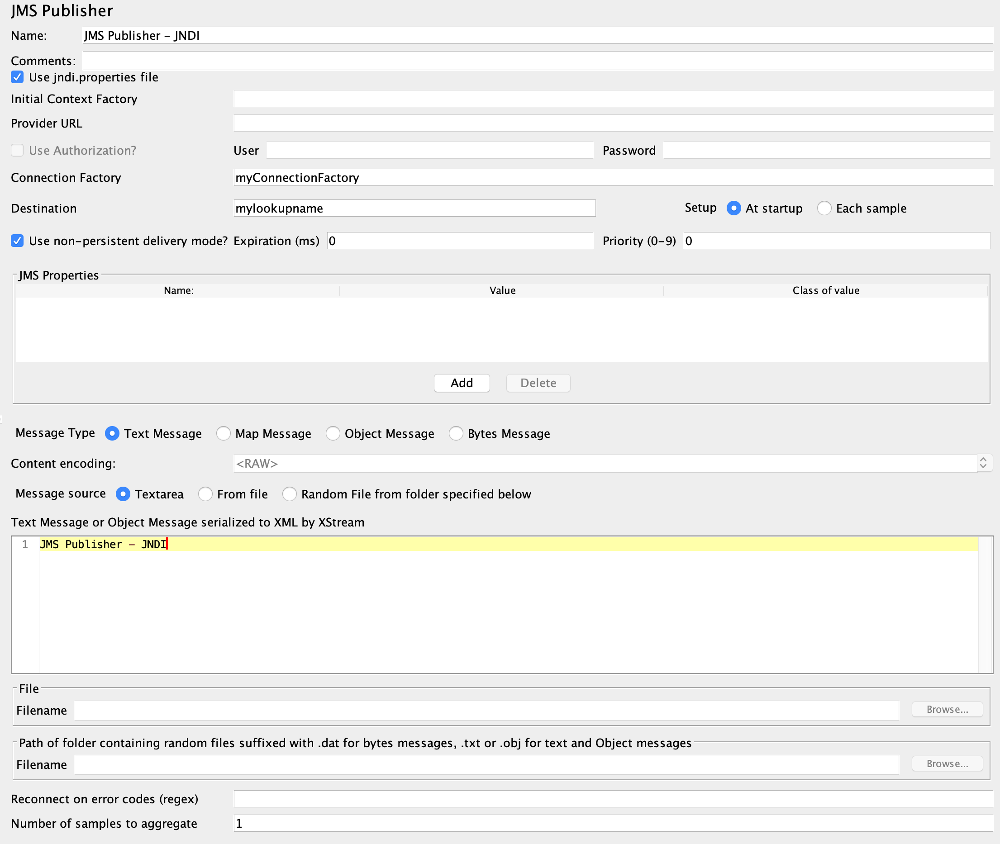

# Using JMeter with ActiveMQ Artemis

JMeter can interact with a message broker through the standard JMS interface. It requires a JNDI Context to read connection parameters as it used to be with J2EE application servers. Artemis being a standalone message broker doesn't provide a JNDI service, but related client libraries has InitialContextFactory implementations that we can use to create a "mock" JNDI Context required by the JMeter samplers.

We can choose between the following Java clients (and the included _InitialContextFactory_) to connect to the broker:

* Artemis Core client
* Qpid AMQP client
* Openwire client

The InitialContextFactory implementations in these client libraries have some differences that we need to understand before trying to use them in JMeter samplers. (This will make more sense when we look at the JMeter side)

We need to add the cient jar files from `$ARTEMIS_HOME/lib` to JMeter's classpath. Simply copy these file to `$JMETER_HOME/lib` (or maybe use the _user.classpath_ property):

* Artemis Core client: _artemis-jms-client-all-x.z.y.jar_
* Qpid AMQP client: _artemis-jms-client-all-x.z.y.jar_, _qpid-jms-client-x.y.z.jar_, _proton-j-x.y.z.jar_
* Openwire client: _activemq-all-x.z.y.jar_

## Artemis Core client

Java client for Artmeis Core protocol with _org.apache.activemq.artemis.jndi.ActiveMQInitialContextFactory_ JDNI Context:

* Documentation: http://activemq.apache.org/components/artemis/documentation/latest/using-jms.html
* Source: https://github.com/apache/activemq-artemis/blob/master/artemis-jms-client/src/main/java/org/apache/activemq/artemis/jndi/ActiveMQInitialContextFactory.java

The JNDI property naming convention for _org.apache.activemq.artemis.jndi.ActiveMQInitialContextFactory_:

* The connection url for the broker should be set in a JNDI property matching the connection factory lookup name with the `connectionFactory.` prefix. For example as `connectionFactory.myFactoryLookupName=tcp://localhost:61616`. The accepted protocols are _tcp://_, _udp://_, _vm://_, _jgroups://_ (I only tried _tcp_).
* The queue or topic name on the broker side should be set as JNDI property with _queue._ or _topic._ prefix. For example `queue.myDestinationLookupName=myqueue` or `topic.myDestinationLookupName=mytopic`. 
* As this the queue/topic lookup logic adds an extra layer of complexity, the class supports _dynamicQueues/_ and _dynamicTopics/_ prefixes where we can simply add the broker side name of the queue or topic and we don't need to set the _queue.*_ or _topic.*_ JNDI properties at all. To connect to _myqueue_ on the broker we can just use `dynamicQueues/myqueue` as the destination lookup name in the samplers.

Surprisingly if the Provider URL (or _java.naming.provider.url_ property) is set, it's parsed as a broker connection url - instead of a JNDI provider endpoint - by the _ActiveMQInitialContextFactory_  and it's added to the JNDI context as `ConnectionFactory` lookup name, see later how this feature (?) can be utilized.

## Qpid AMQP client

The Qpid AMQP Java client has the class _org.apache.qpid.jms.jndi.JmsInitialContextFactory_ for JNDI Context support.

* Documentation: https://qpid.apache.org/releases/qpid-jms-0.54.0/docs/index.html
* Source: https://github.com/apache/qpid-jms/blob/master/qpid-jms-client/src/main/java/org/apache/qpid/jms/jndi/JmsInitialContextFactory.java

The JNDI property naming convention for _org.apache.qpid.jms.jndi.JmsInitialContextFactory_:

* The connection url for the broker should be set in a JNDI property matching the connection factory lookup name with the `connectionfactory.` prefix. For example as `connectionfactory.myFactoryLookupName=amqp://localhost:5672`. The accepted protocols are _amqp://_, _amqps://_, _amqpws://_, _amqpwss://_.
* Setting queue or topic name is the same as for _ActiveMQInitialContextFactory_. Use JNDI properties with _queue._ or _topic._ prefix. For example `queue.myDestinationLookupName=myqueue` or `topic.myDestinationLookupName=mytopic`. 
* This InitialContextFactory also supports _dynamicQueues/_ and _dynamicTopics/_ prefixes, so we don't need to set the JDNI properties for destination names. For example `_dynamicQueues/myqueue_`.

If the Provider URL (or _java.naming.provider.url_ property) is set, a file url or path is expected that will be parsed instead of the _jndi.properties_ on the classpath. This is an important difference compared to _ActiveMQInitialContextFactory_.

## Openwire client

Java client for ActiveMQ Openwire protocol with _org.apache.activemq.jndi.ActiveMQInitialContextFactory_ JDNI Context:

* Documentation: http://activemq.apache.org/components/artemis/documentation/latest/using-jms.html
* Source: https://github.com/apache/activemq/blob/main/activemq-client/src/main/java/org/apache/activemq/jndi/ActiveMQInitialContextFactory.java

The JNDI property naming convention for _org.apache.activemq.jndi.ActiveMQInitialContextFactory_:

* The connection url for the broker should be set in a JNDI property matching the connection factory lookup name with the `connection.` prefix. For example as `connection.ConnectionFactory=tcp://localhost:61616`. The accepted protocols are _tcp://_.
* The queue or topic name on the broker side should be set as JNDI property with _queue._ or _topic._ prefix. For example `queue.myDestinationLookupName=myqueue` or `topic.myDestinationLookupName=mytopic`. 
* As this the queue/topic lookup logic adds an extra layer of complexity, the class supports _dynamicQueues/_ and _dynamicTopics/_ prefixes where we can simply add the broker side name of the queue or topic and we don't need to set the _queue.*_ or _topic.*_ JNDI properties at all. To connect to _myqueue_ on the broker we can just use `dynamicQueues/myqueue` as the destination lookup name in the samplers.

Surprisingly if the Provider URL (or _java.naming.provider.url_ property) is set, it's parsed as a broker connection url - instead of a JNDI provider endpoint - by the _ActiveMQInitialContextFactory_  and it's added to the JNDI context as `ConnectionFactory` lookup name, see later how this feature (?) can be utilized.

// To interact with a queue or a topic JMeter will do a JNDI lookup for a destination so we need a JDNI parameter respectively with _queue._ or _topic._ prefix (prefix is case insensitive). This prefix will also decide if the destination will be expected as a queue or a topic. If we want to use a queue called "myqueue" on the broker we need an JNDI property _queue.myDestinationLookupName=myqueue_ or in case of a topic _topic.myDestinationLookupName=mytopic_. The destination name _myDestinationLookupName_ must be used in the JMeter semplers. 

// As this the lookup logic add an extra layer of complexity the class supports _dynamicQueues/_ and _dynamicTopics/_ prefixes where we simply can add the name of the queue or tpoic on the broker and we don't need to add the JNDI parameters. To connect to "myqueue" on the broker we can just use _dynamicQueues/myqueue_ as the destination lookup name in the samplers. 

Let's see how we can use these clients in JMS samplers.

## JMS Point-to-point

This sampler can send (and receive reply) messages to queues only. It has a nice a JNDI Properties table on GUI, so we don't need to edit a _jndi.properties_ file.

*Artemis Core client*

Set fields as:

* _Initial Context Factory_: `org.apache.activemq.artemis.jndi.ActiveMQInitialContextFactory`
* _QueueConnection Factory_: lookup name (e.g. `myConnectionFactory`). Add the broker url to the _JNDI properties_ table `connectionFactory.myConnectionFactory=tcp://localhost:61616_`. (Alternatively the broker url can be set as _Provider URL_ with lookup name `ConnectionFactory`)
* The queue name should be stored in a JNDI property `queue.mylookupname=myqueue` and having set _JNDI name Request/Receive queue_ to `mylookupname`. Or we can use lookup name `dynamicQueues/myqueue` so we can skip the queue JNDI property.


*Qpid AMQP client*

Set fields:

* _Initial Context Factory_: `org.apache.qpid.jms.jndi.JmsInitialContextFactory`
* _QueueConnection Factory_ : Add the connection url lookup name to the JNDI properties table `connectionfactory.myConnectionFactory=amqp://artemishost:5672`
* The broker side queue name comes to `queue.mylookupname=myqueue` in the JNDI table. _JNDI name Request/Receive queue_ is set accordingly to `mylookupname`. Or we can use `dynamicQueues/myqueue`.

o

*Openwire client*

Set fields:

* _Initial Context Factory_: `org.apache.activemq.jndi.ActiveMQInitialContextFactory`
* _QueueConnection Factory_: lookup name (e.g. `ConnectionFactory`). Add the broker url to the _JNDI properties_ table `connection.ConnectionFactory=tcp://localhost:61616_`. (Alternatively the broker url can be set as _Provider URL_ with lookup name `ConnectionFactory`)
* The queue name should be stored in a JNDI property `queue.mylookupname=myqueue` and having set _JNDI name Request/Receive queue_ to `mylookupname`. Or we can use lookup name `dynamicQueues/myqueue` so we can skip the queue JNDI property.


[NOTE]
====
Note: For both protocols the authentication username/password can be set in the usual `java.naming.security.principal` and `java.naming.security.credentials` JNDI properties.
====

## JMS Publisher

This sampler can send messages to queues and topics too. It has no generic JNDI propeties table, but it comes with several GUI fields instead.

*Artemis Core client*

Because of the beforementioned feature of _org.apache.activemq.artemis.jndi.ActiveMQInitialContextFactory_ using the _Provider URL_ as broker connection string it's possible to configure simple scenarios without using _jndi.properties_ file. Set fields as:

* _Initial Context Factory_: `org.apache.activemq.artemis.jndi.ActiveMQInitialContextFactory`
* _Provider URL_: `tcp://artemis_host:61616`
* _Connection Factory_: `ConnectionFactory`
* Username and password if _Use Authorization?_ is required. 
* _Destination_: `dynamicQueues/myqueue` (so we can skip the queue JNDI properties).


*Qpid AMQP client*

The challange with _org.apache.qpid.jms.jndi.JmsInitialContextFactory_ and this sampler is to set the broker connection url. We can't set it on the GUI, we'll need a _jndi.properties_ file for that. This _JmsInitialContextFactory_ class tries to parse the file url or path set in the _Provider URL_ field as a _jndi.properties_ file so we don't have to add that file to classpath:

* Leave the _Use jndi.properties file_ unchecked
* _Provider URL_: the location of our jndi file (e.g. `/tmp/myjndi.properties`)
** In that _myjndi.properties_ file we need `connectionfactory.myConnectionFactory=amqp://localhost:5672`
* _Connection Factory_ : the lookup name (`myConnectionFactory`).

For the rest we can use the GUI fields:

* Username and password if _Use Authorization?_ is required. 
* _Destination_: `dynamicQueues/myqueue` (so we can skip the queue JNDI properties in the file).


## JMS Subscriber

The _JMS Subscriber_ sampler's parameters match the _JMS Publisher_ sampler's fields.

## Using a _jndi.properties_ file

In the examples above we - mostly - avoided creating a _jndi.properties_ file and adding it to the classpath. Let's try that approach instead of being dependent on the parameters of the samplers.
A text file can be added to the classpath by packaging it into a jar file and adding that jar file to JMeter's classpath:

* Create a file called _jndi.properties_
* Package it into a jar 

  jar -cf my-jndi-properties.jar jndi.properties

* Add to JMeter's classpath by one of the following ways:
** Drop the jar in the `lib` directory:

   cp my-jndi-properties.jar $JMETER_HOME/lib/

** Add `user.classpath` entry to `$JMETER_HOME/bin/user.properties` (or `$JMETER_HOME/bin/system.properties`):

   user.classpath=/path/my-jndi-properties.jar

** Add `user.classpath` as JMeter user property via the command line:

   $JMETER_HOME/jmeter.sh -Juser.classpath=/path/my-jndi-properties.jar

** Add `user.classpath` as Java system property via an env var:

   export JMETER_OPTS=-Duser.classpath=/path/my-jndi-properties.jar; $JMETER_HOME/jmeter.sh 

The _jndi.properties_ should look something like this:
```
# Using AMQP protocol
java.naming.factory.initial=org.apache.qpid.jms.jndi.JmsInitialContextFactory
connectionfactory.myConnectionFactory=amqp://localhost:5672

# Using Artemis Core protocol
#java.naming.factory.initial=org.apache.activemq.artemis.jndi.ActiveMQInitialContextFactory
#connectionFactory.myConnectionFactory=tcp://localhost:61616

java.naming.security.principal=amq
java.naming.security.credentials=secret
queue.mylookupname=myqueue
topic.mytopiclookupname=mytopic
```
In the samplers we only need to set the lookup name for the ConnectionFactory (`myConnectionFactory`) and the Queue/Topic (`myqueue`) - or we can use _dynamicQueues/_ prefix.


In _JMS Publisher/Subscriber_ enable _Use jndi.properties file_ to make this work.



### How to use _jndi.properties_ without a jar?

Unfortunately I'm not aware of a solution to add the _jndi.properties_ to the JMeter classpath without packaging it in a jar file. Setting all properties as Java system properties - passed in the command line or `$JMETER_HOME/bin/system.properties` - doesn't work, only the `java.naming.*` are used.

As long as we'd like to use the Qpid AMQP client and `org.apache.qpid.jms.jndi.JmsInitialContextFactory` we can set the Provider URL `java.naming.provider.url` point to our _jndi.properties_ file:

`export JMETER_OPTS='-Djava.naming.provider.url=/tmp/my-jndi.properties -Djava.naming.factory.initial=org.apache.qpid.jms.jndi.JmsInitialContextFactory'; $JMETER_HOME/jmeter.sh`

The _jndi.properties_ file is read every time we run the JMeter test (as a new object is created) so we don't even need to restart JMeter if we make modifications in the file.

This doesn't work with org.apache.activemq.artemis.jndi.ActiveMQInitialContextFactory as it expects a broker url in the _java.naming.provider.url_ property.

# Files in this repo

JMeter example files in this repo:

* JMS-samplers.jmx: Contains an example of each JMS Sampler.
* JMS-send.jmx: Send messages using _JMS Publisher_ with AMQP client using a _jndi.properties_ file. Run as:

  export JMETER_OPTS='-Djava.naming.provider.url=./jndi.properties -Djava.naming.factory.initial=org.apache.qpid.jms.jndi.JmsInitialContextFactory'; \
  $JMETER_HOME/bin/jmeter.sh -Jthroughput=6000 -Jthreads=100 -Jloopcount=1000 -Jmessagelength=5 -Jextrapropertylength=10000  -t ./JMS-send.jmx -n -l ./JMS-send.out

* JMS-receive.jmx: Receive messages using _JMS Subscriber_ with AMQP client using a _jndi.properties_ file. Run as:

  export JMETER_OPTS='-Djava.naming.provider.url=./jndi.properties -Djava.naming.factory.initial=org.apache.qpid.jms.jndi.JmsInitialContextFactory'; \
  $JMETER_HOME/bin/jmeter.sh -t ./JMS-receive.jmx -n -l ./JMS-receive.out

The _JMS-send.jmx_ and _JMS-receive.jmx_ scripts support the following properties:

* `threads`: Number of threads. Default is 1.
* `loopcount`: Number of messages per thread. Default is 1.
* `throughput`: Limit the number of messages handled per minute. Default is -1 (no limit).

The _JMS-send.jmx_ script also support the following properties:

* `messagelength`: Length of random string generated for message body. Default is 1024.
* `extrapropertylength`: Length of random string generated for message property called _EXTRA_. Should be less than 100000. Default is 1.
